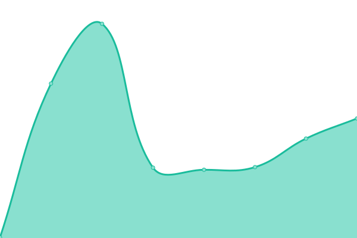

# [📈 Live Status](https://jrmi.github.io/airboardgame_upptime): <!--live status--> **🟧 Partial outage**

This repository contains the open-source uptime monitor and status page for [Jérémie Pardou-Piquemal](https://airboardgame.net), powered by [Upptime](https://github.com/upptime/upptime).

With [Upptime](https://upptime.js.org), you can get your own unlimited and free uptime monitor and status page, powered entirely by a GitHub repository. We use [Issues](https://github.com/jrmi/airboardgame_upptime/issues) as incident reports, [Actions](https://github.com/jrmi/airboardgame_upptime/actions) as uptime monitors, and [Pages](https://jrmi.github.io/airboardgame_upptime) for the status page.

<!--start: status pages-->
<!-- This summary is generated by Upptime (https://github.com/upptime/upptime) -->
<!-- Do not edit this manually, your changes will be overwritten -->
<!-- prettier-ignore -->
| URL | Status | History | Response Time | Uptime |
| --- | ------ | ------- | ------------- | ------ |
|  [Airboardgame](https://airboardgame.net) | 🟩 Up | [airboardgame.yml](https://github.com/jrmi/airboardgame_upptime/commits/HEAD/history/airboardgame.yml) | 

 159ms
     
 | 

<a href="https://jrmi.github.io/airboardgame_upptime/history/airboardgame">100.00%</a>
    

|  [Ricochet](https://ricochetjs-deploy-production.up.railway.app/store/game?fields=_id%2Cboard%2Cowner) | 🟥 Down | [ricochet.yml](https://github.com/jrmi/airboardgame_upptime/commits/HEAD/history/ricochet.yml) | 

 241ms
     
 | 

<a href="https://jrmi.github.io/airboardgame_upptime/history/ricochet">100.00%</a>
    

<!--end: status pages-->

[**Visit our status website →**](https://jrmi.github.io/airboardgame_upptime)

## 📄 License

- Powered by: [Upptime](https://github.com/upptime/upptime)
- Code: [MIT](./LICENSE) © [Jérémie Pardou-Piquemal](https://airboardgame.net)
- Data in the `./history` directory: [Open Database License](https://opendatacommons.org/licenses/odbl/1-0/)
